# **FlyVenta**

***
* **Descripción:**
  FlyVenta es una aplicación web que nos permitirá vender y comprar artículos de segunda mano. Os preguntaréis por qué otra página de segunda mano si ya hay muchas, FlyVenta omitirá los mensajes con el comprador para así evitar conversaciones odiosas.
  Todos los articulos se mandaran por correos, al vendedor no le llegará el dinero hasta que el comprador no confirme el producto y de esta forma evitaremos tener que salir de casa para quedar con una persona desconocida.

* ¿Entonces como podremos pedir a un vendedor que nos lo venda más barato el articulo?

  - En FlyVenta tendremos una opción para hacer una contraoferta, donde el vendedor puede aceptarla o no.

* ¿Cómo sabra el vendedor la dirección del cliente?

  - No lo sabrá, pero gracias a trabajar con correos ellos sabran la dirección con el codigo de barras que se tendrá que mostrar en la sucursal.

**¡Empieza a vender desde hoy mismo!**
***

## Equipo de desarrollo
| **Apellidos, Nombre**   | **Correo de la universidad**     | **Cuenta Github** |
|-------------------------|----------------------------------|-------------------|
| Ruiz Morán, Miguel      | m.ruizm.2019@alumnos.urjc.es     | migueelruiiz      |
| Rusu, Samuel            | s.rusu.2019@alumnos.urjc.es      | samuelrusu3       |
| Molinero Mellado, Jaime | j.molinero.2019@alumnos.urjc.es  | Jaiime00          |
| Cardi Pérez, Francis    | f.cardi.2019@alumnos.urjc.es     | Fcardiperez       |

## Trello para la coordinación del equipo

https://trello.com/b/Asdin3o1/proyecto

## Aspectos principales de la aplicación:

***
* **Entidades:**
  - Usuario: tendrá la posibilidad de subir anuncios, venderlos aceptando ofertas o directamente tras la compra de otro usuario, y comprar uno mismo otros productos anunciados con la posibilidad de realizar contraofertas (siempre que se haya registrado), adicionalmente se podrá buscar y visualizar todos los anuncios disponibles en la web.

  - Anuncio: Estará relacionado con un usuario el cual será su vendedor.

  - Compraventa: Tendrá relación junto a dos usuarios, un comprador y un vendedor y junto a un anuncio.

  - Contraoferta: Estará asociada junto a un usuario que sea el que la realice y un anuncio en base al cual se desee discutir el precio.

***
* **Permisos de los usuarios:**

  - Usuario anónimo: Podrá únicamente visualizar los anuncios de los usuarios registrados.

  - Usuario registrado: Será dueño de los anuncios, compraventas (tanto como vendedor como comprador) y de las contraofertas de otros usuarios hacia sus anuncios, y tendrá la posibilidad de visualizar el resto de anuncios de otros usuarios, modificar los suyos (así como eliminarlos) o rechazar y aceptar contraofertas.

  - Usuario administrador: Será dueño de las tres entidades pero con la posibilidad de modificar cada uno de ellas.

***
* **Imágenes:**

  - Usuario: Los usuarios registrados tendrán la posibilidad de subir una foto para establecerla como foto de perfil.

  - Anuncio: Los anuncios deberán contener al menos una imagen, subida por el usuario vendedor, de manera que se visualice el estado del producto.

***
* **Gráficos:**

  - Cada usuario tendrá disponible un gráfico en su perfil donde visualizar los gastos y las ganancias de cada mes. El gráfico será de barras y representará con dos colores diferentes gastos y las ganancias.

***
* **Tecnología complementaria:**

  - Cuando un usuario realice una contraoferta o compre directamente un producto (anuncio), se mandará un correo al vendedor de dicho producto para, que rechace o acepte la contraoferta o sea notificado correctamente de la venta en cada caso. Ademas al hacer la compra se creará un pdf mostrando la compra y al vendedor también se le mandará un pdf con la etiqueta de correos y un código de barras que tendrá que mostrar en una sucursal para el envio.

***
* **Algoritmo o consulta avanzada:**

  - Sugerimos productos al usuario en función de sus búsquedas realizadas. A partir de estas búsquedas analizamos una serie de parámetros como categoría, valoración del vendedor, rango de precio y tiempo del anuncio con la intención de mostrar unos productos que le resulten interesantes para comprar, así como mostrarle opciones dentro de lo que ha demostrado buscar que no ha visto y así facilitarle la búsqueda.

***
* **Capturas de pantalla fase 2:**

  - Esta es la página principal de la web, desde donde podrá dirigirse al resto de páginas

    

    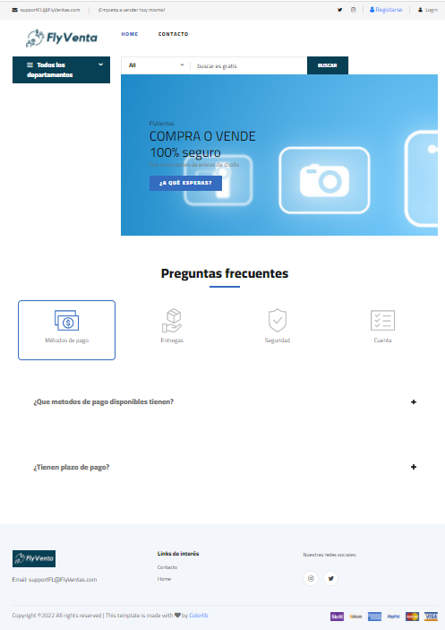
    

  - Desde donde nos encargaremos de buscar el producto que nos interesa.
    

    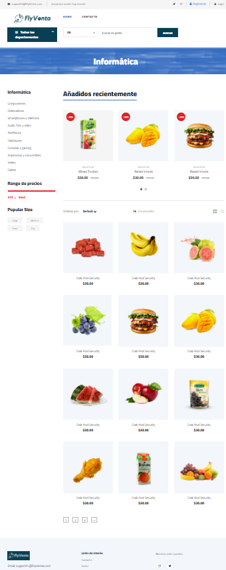
    

  - La página donde procedemos con el pago.
    

    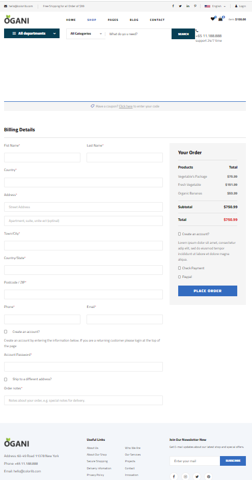
    

  - Podremos seleccionar el método de pago que no sinteresa, también nos mostrará una breve información del producto seleccionado y el precio final, por último tenemos 2 botones que nos permiten proceder con la pasarela de pago o bien cancelar la compra.
    

    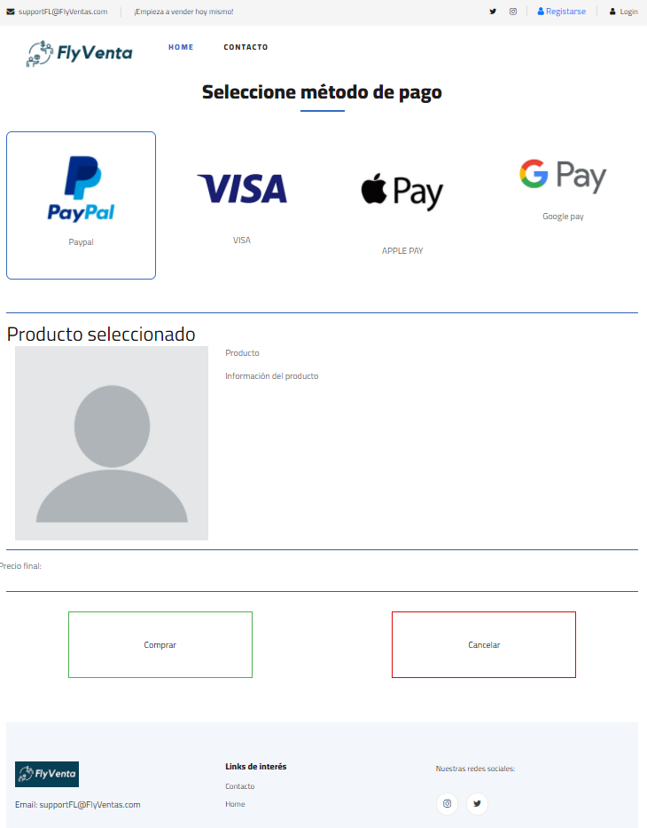
    

  - Mostramos cómo contactar con la empresa así como los datos.
    

    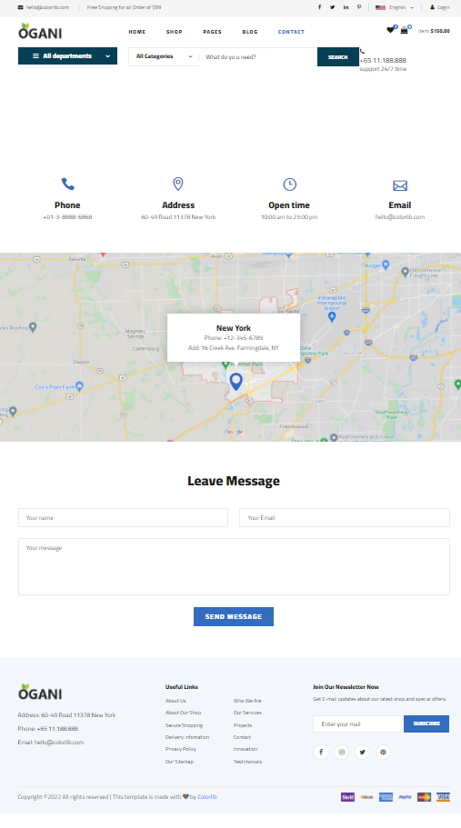
    

  - Una pantalla de inicio de sesión que permite pasar a la de registro
    

    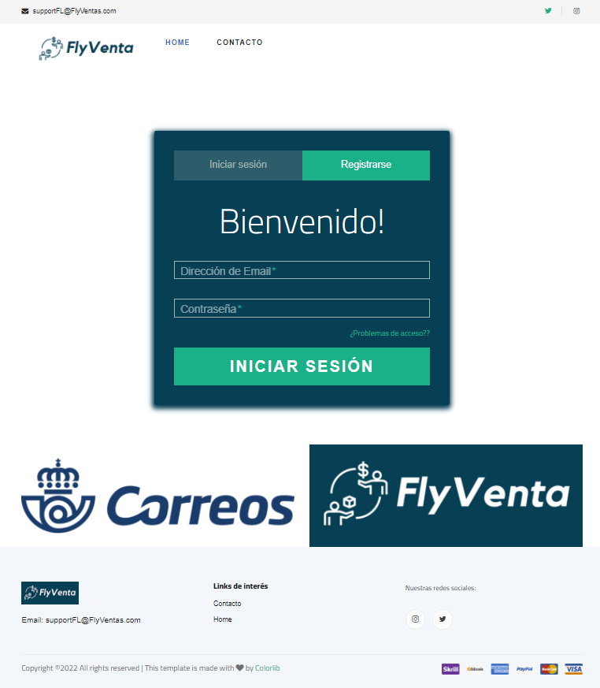
    

  - Página de tu propio perfil donde tendrás los datos introducidos en la página.
    

    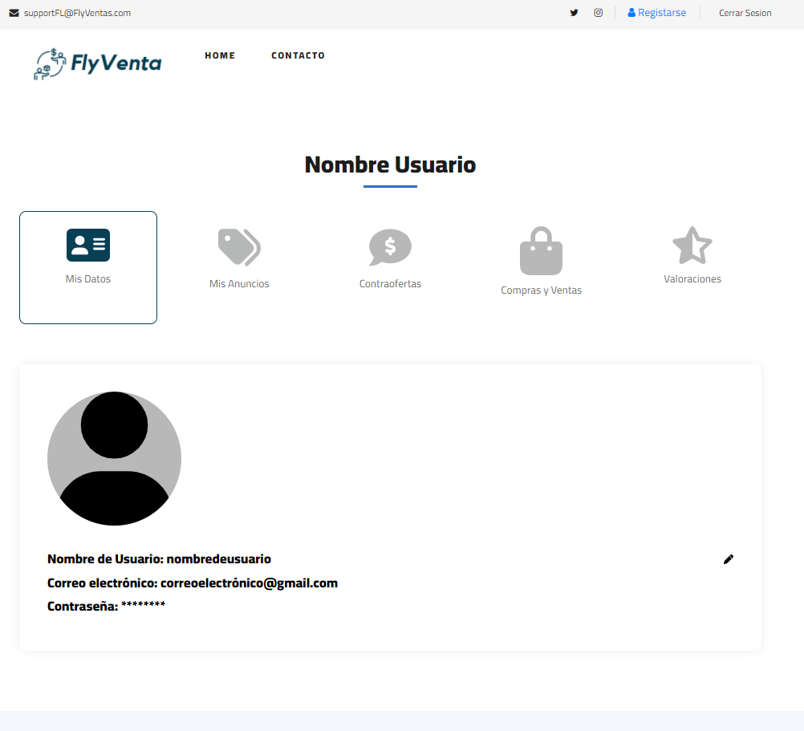
    

  - Página que muestra fotos, descripción y vendedor del producto, por último la opción de comprar o hacer la contraoferta al vendedor.
    

    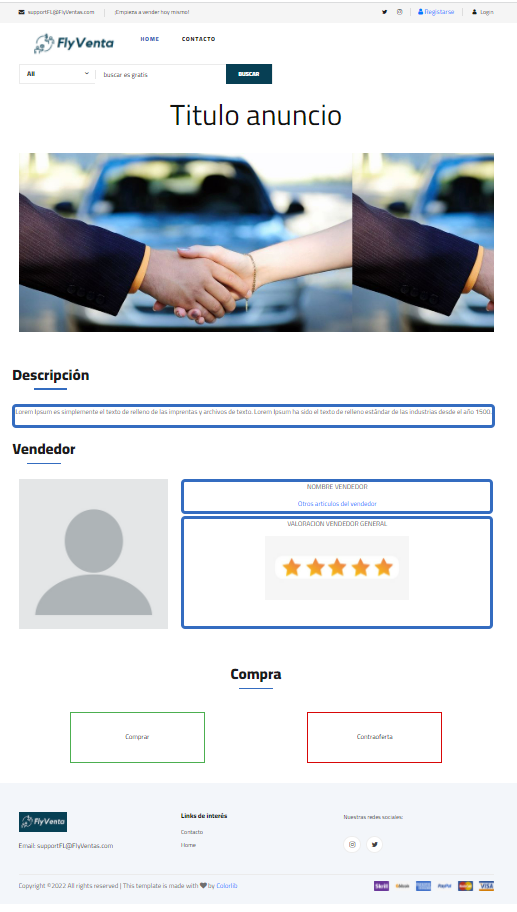
    

  - Primera fase del registro donde se meten unos datos básicos.
    

    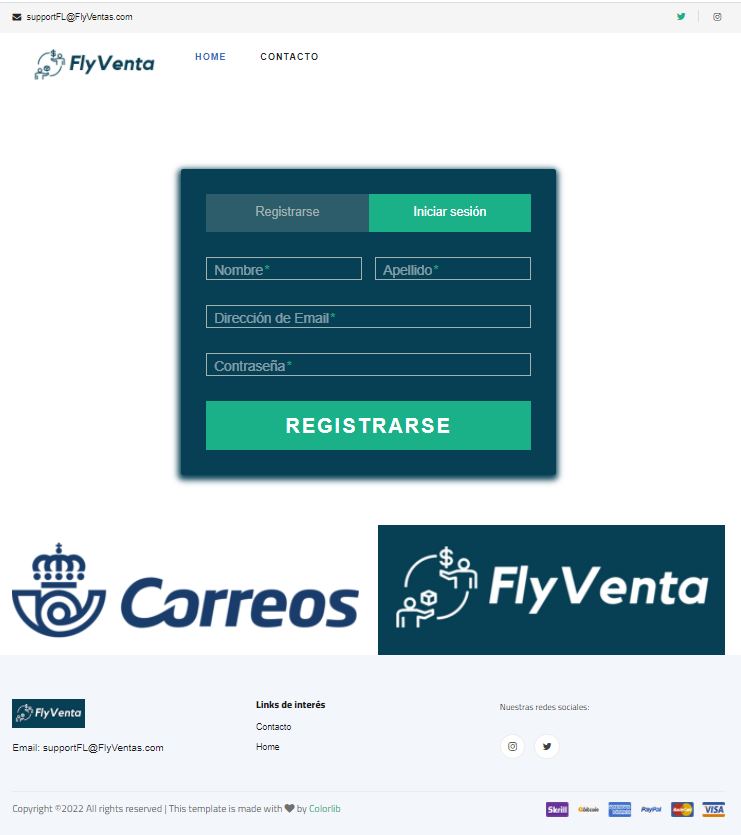
    

  - Pulsando un botón muestra un desplegable para seguir rellenando datos.
    

    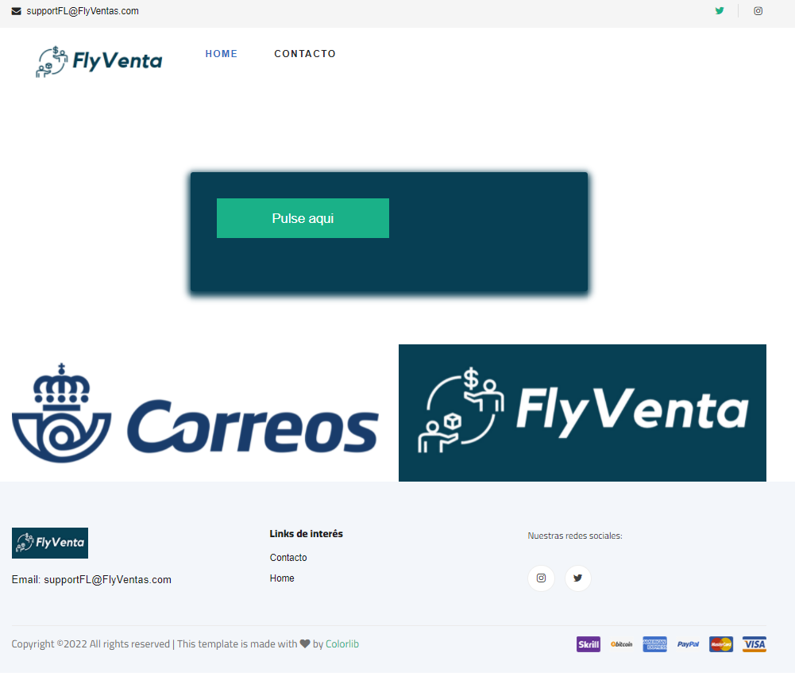
    

  - Página de error que se genera.
    

    
    

***
* **Diagrama de navegación fase 1:**
  -diagrama
    

    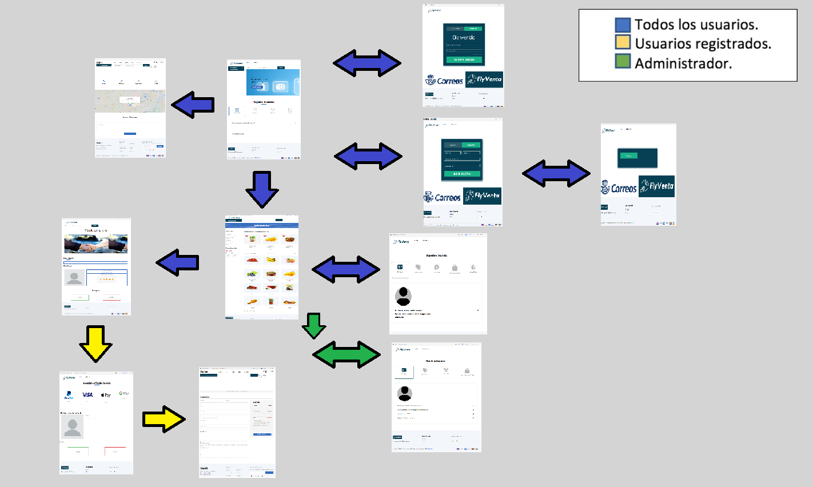
    

***
* **Instrucciones de ejecución:**
  - Para descargar el código accederemos a este link: https://github.com/CodeURJC-DAW-2021-22/webapp2
  - Una vez nos encontremos en el link encontraremos un botón de color verde con letras blancas en el que pone "code",
    clicaremos en el y o bien clonamos el repositorio con el link que nos proporcionan en nuestro editor o descargamos el zip con el código,
    En cualquiera de los casos nos dirijimos a nuestro editor de código favorito y lanzamos la aplicación. En algunos editores
    como springboot para lanzar la aplicación tendremos que clicar con el botón derecho en el application.java y darle a run like springboot app
    -En cuanto a requisitos hemos montado la aplición con java 8 y con PostgreSQL 6.6.

***
* **Diagrama con las entidades de la base de datos**

    

    
    

***
* **Diagrama con las entidades de la base de datos**

    

    
    
