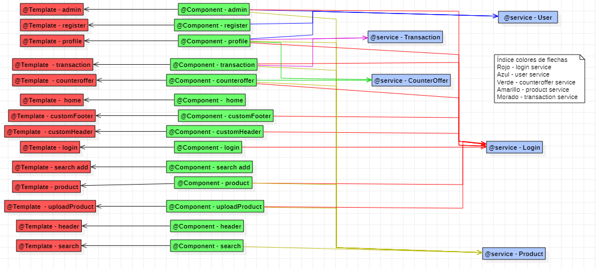

# **FlyVenta**

***
* **Descripción:**
FlyVenta es una aplicación web que nos permitirá vender y comprar artículos de segunda mano. Os preguntaréis por qué otra página de segunda mano si ya hay muchas, FlyVenta omitirá los mensajes con el comprador para así evitar conversaciones odiosas.
Todos los articulos se mandaran por correos, al vendedor no le llegará el dinero hasta que el comprador no confirme el producto y de esta forma evitaremos tener que salir de casa para quedar con una persona desconocida. 

* ¿Entonces como podremos pedir a un vendedor que nos lo venda más barato el articulo? 

    - En FlyVenta tendremos una opción para hacer una contraoferta, donde el vendedor puede aceptarla o no.

* ¿Cómo sabra el vendedor la dirección del cliente? 

    - No lo sabrá, pero gracias a trabajar con correos ellos sabran la dirección con el codigo de barras que se tendrá que mostrar en la sucursal.

**¡Empieza a vender desde hoy mismo!**
***

## Equipo de desarrollo
| **Apellidos, Nombre**   | **Correo de la universidad**     | **Cuenta Github** |
|-------------------------|----------------------------------|-------------------|
| Ruiz Morán, Miguel      | m.ruizm.2019@alumnos.urjc.es     | migueelruiiz      |
| Rusu, Samuel            | s.rusu.2019@alumnos.urjc.es      | samuelrusu3       |
| Molinero Mellado, Jaime | j.molinero.2019@alumnos.urjc.es  | Jaiime00          |
| Cardi Pérez, Francis    | f.cardi.2019@alumnos.urjc.es     | Fcardiperez       |

## Trello para la coordinación del equipo

https://trello.com/b/Asdin3o1/proyecto

## Aspectos principales de la aplicación:

***
* **Entidades:**
    - Usuario: tendrá la posibilidad de subir anuncios, venderlos aceptando ofertas o directamente tras la compra de otro usuario, y comprar uno mismo otros productos anunciados con la posibilidad de realizar contraofertas (siempre que se haya registrado), adicionalmente se podrá buscar y visualizar todos los anuncios disponibles en la web.

    - Anuncio: Estará relacionado con un usuario el cual será su vendedor.

    - Compraventa: Tendrá relación junto a dos usuarios, un comprador y un vendedor y junto a un anuncio.

    - Contraoferta: Estará asociada junto a un usuario que sea el que la realice y un anuncio en base al cual se desee discutir el precio.

***
* **Permisos de los usuarios:**

    - Usuario anónimo: Podrá únicamente visualizar los anuncios de los usuarios registrados.

    - Usuario registrado: Será dueño de los anuncios, compraventas (tanto como vendedor como comprador) y de las contraofertas de otros usuarios hacia sus anuncios, y tendrá la posibilidad de visualizar el resto de anuncios de otros usuarios, modificar los suyos (así como eliminarlos) o rechazar y aceptar contraofertas.

    - Usuario administrador: Será dueño de las tres entidades pero con la posibilidad de modificar cada uno de ellas.

***
* **Imágenes:**

    - Usuario: Los usuarios registrados tendrán la posibilidad de subir una foto para establecerla como foto de perfil.

    - Anuncio: Los anuncios deberán contener al menos una imagen, subida por el usuario vendedor, de manera que se visualice el estado del producto.

***
* **Gráficos:**

    - Cada usuario tendrá disponible un gráfico en su perfil donde visualizar los gastos y las ganancias de cada mes. El gráfico será de barras y representará con dos colores diferentes gastos y las ganancias.

***
* **Tecnología complementaria:**

    - Cuando un usuario realice una contraoferta o compre directamente un producto (anuncio), se mandará un correo al vendedor de dicho producto para, que rechace o acepte la contraoferta o sea notificado correctamente de la venta en cada caso. Ademas al hacer la compra se creará un pdf mostrando la compra y al vendedor también se le mandará un pdf con la etiqueta de correos y un código de barras que tendrá que mostrar en una sucursal para el envio.

***
* **Algoritmo o consulta avanzada:**

    - Sugerimos productos al usuario en función de sus búsquedas realizadas. A partir de estas búsquedas analizamos una serie de parámetros como categoría, valoración del vendedor, rango de precio y tiempo del anuncio con la intención de mostrar unos productos que le resulten interesantes para comprar, así como mostrarle opciones dentro de lo que ha demostrado buscar que no ha visto y así facilitarle la búsqueda.
    
***
* **Capturas de pantalla fase 1:**
    
    - Esta es la página principal de la web, desde donde podrá dirigirse al resto de páginas

    

    
    

     
    - Desde donde nos encargaremos de buscar el producto que nos interesa.
    

    
    

    
    - La página donde procedemos con el pago.
    

    
    

    - Podremos seleccionar el método de pago que no sinteresa, también nos mostrará una breve información del producto seleccionado y el precio final, por último tenemos 2 botones que nos permiten proceder con la pasarela de pago o bien cancelar la compra.
    

    
    

    - Mostramos cómo contactar con la empresa así como los datos.
    

    
    

    - Una pantalla de inicio de sesión que permite pasar a la de registro
    

    
    

    - Página de tu propio perfil donde tendrás los datos introducidos en la página.
    

    
    

    - Página que muestra fotos, descripción y vendedor del producto, por último la opción de comprar o hacer la contraoferta al vendedor. 
    

    
    

    - Primera fase del registro donde se meten unos datos básicos.
    

    
    

    - Pulsando un botón muestra un desplegable para seguir rellenando datos.
    

    
    

***
* **Diagrama de navegación fase 1:**

    

    
    

# Fase 3

### Requisitos:

Para poder ejecutar tanto la construccion de la imagen docker de la aplicación como para ejecutarla y posteriormente 
desplegarla en Heroku será necesario:

1. Tener instalado docker desktop en nuestro ordenador (esto ya incluye la herramienta docker-compose)
2. Tener instalado el cliente de heroku en nuestro ordenador
3. Tener la aplicación descargada y accesible para poder ejecutar los comandos desde alguna de las carpetas específicas 

***
### La URL de la aplicación desplegada en Heroku:

**https://codeurjc-daw-2021-22-webapp2.herokuapp.com/**

***
### Documentación de la API REST:**

**https://github.com/CodeURJC-DAW-2021-22/webapp2/blob/main/backend/api-docs/api-docs.yaml**

**production: https://rawcdn.githack.com/CodeURJC-DAW-2021-22/webapp2/a31383de6ee70f0199a599795962cc7c8843fd13/backend/api-docs/api-docs.html**

**development: https://raw.githack.com/CodeURJC-DAW-2021-22/webapp2/main/backend/api-docs/api-docs.html**

### Actualización de diagrama de clases:**

    

***
### Instrucciones de ejecución de la aplicación dockerizada:

* Ejecutar la aplicación dockerizada:

Para ejecutar la aplicación ya dockerizada junto a la base de datos usando el dichero docker-compose.yml deberemos
al igual que en el paso anterior, ubicarnos en la carpeta de docker para poder ejecutar el fichero correctamente. Una vez
hecho esto, deberemos ejecutar el comando docker-compose -f docker_compose.yml up. El cual ejecutará la aplcación con las
instrucciones que están dentro del fichero, es decir, la aplicación web a partir de la imagen docker construida anteriormente, 
y la base de datos creada en base a una imagen de postgre seleccionada. Después de ejecutar el comando, arrancará la app y 
tendremos disponibles todas las funcionalidades, accediendo a la dirección del buscador "https://localhost:8443". 

***
### Documentación para construcción de la imagen docker:
* Construcción de la imagen docker:

Para construir la imagen docker de la aplicación tenemos la opción de simplemente ejecutar el script ubicado en la 
carpeta docker junto al resto de archivos relacionados con este tema como el Dockerfile. El script tiene el comando 
de construcción de docker que crea la imagen a partir del dockerfile con el nombre que posteriormente querremos que tenga
para que pueda desplegarse en heroku. El comando construirá la imagen y la guardará en local, para poder subirla a dockerHub
necesitaríamos el comando push, el cual subiría a nuestro repositorio la imagen creada.

***
### Documentación para desplegar en Heroku:

* Documentación para desplegar en Heroku:

Como hemos indicado antes, será necesario tener descargado el cliente de heroku en el ordenador. Los comandos a realizar para desplegar la app 
en heroku se encuentran en un script en la carpeta doceker del proyecto llamado deploy_heroku_app_webapp2.ps1. Los comandos que
se ejecutan son tanto los de creación como subida de la imagen de la app con el nombre requerido por heroku (el mismo que la app 
ya creada en el perfil), y la subida de la imagen a heroku para su posterior ejecución con todos los servicios disponibles.

***

### Participación de miembros:

***
    - Francis Cardi: Despliegue en heroku y creación de imagen con los requerimientos de Heroku. Ayuda en la dockerización de la aplicación, la creación de los ficheros de la carpeta docker, rest de las imagenes de los productos, get de todos los productos, paginacion, busqueda y hacer presentable la documentación.
***
    - Miguel Ruiz: creación de entidades y relaciones entre tablas. Retoques importantes a transacciones y creación de la funcionalidad de contraoferta. Subida y visualización de imágenes, solución de bugs.
***
    - Jaime Molinero: ProductRestController, arreglo de bugs en el resto de controladores rest, fichero postman, documentación API-DOC generado con spring
***
    - Samuel Rusu: controladores rest de user, transaction, login y counteroffer, toda la parte de seguridad api rest

***
### Commits más importantes:

**Francis Cardi:**

1. act carpeta https://github.com/CodeURJC-DAW-2021-22/webapp2/commit/d5e56c79b409cfe41746ad15b1356cd2b87f9536
2. ultimos retoques https://github.com/CodeURJC-DAW-2021-22/webapp2/commit/9fb562d4364c78941edd47f3126be88e6c0314fc
3. proceso automatizado desplegar heroku https://github.com/CodeURJC-DAW-2021-22/webapp2/commit/33887292c073b813a8028eafb1bf51bfc9a365e5
4. Rest(Busqueda,paginación y mostrar todos los productos) https://github.com/CodeURJC-DAW-2021-22/webapp2/commit/45e23052e70a1800a49a915f75f5798b37849b2c
5. Union docker y main + resuelto bug de imagenes put, post y get https://github.com/CodeURJC-DAW-2021-22/webapp2/commit/f35af927a0669a0c8d52a8bc51b8f18bb040f8a1

**Miguel Ruiz:**

1. https://github.com/CodeURJC-DAW-2021-22/webapp2/commit/f0e9acc0d1d45ae694d71ab82c91cf0f2f13e93b
2. https://github.com/CodeURJC-DAW-2021-22/webapp2/commit/5ce324410f1fb33868dde4adc283557c37094ffe
3. https://github.com/CodeURJC-DAW-2021-22/webapp2/commit/f0e9acc0d1d45ae694d71ab82c91cf0f2f13e93b
4. https://github.com/CodeURJC-DAW-2021-22/webapp2/commit/24d19b81e600dade423779407fd55762287b4ecf
5. https://github.com/CodeURJC-DAW-2021-22/webapp2/commit/ce39ed1d3076097d8edca16fd5aa1228054b8eec

**Jaime Molinero:**

1. restProduct: https://github.com/CodeURJC-DAW-2021-22/webapp2/commit/ebd78ef4af8e83093fcfa00bbbd64cd799ae3e4b
2. avance y resolucion de bugs: https://github.com/CodeURJC-DAW-2021-22/webapp2/commit/5d662106b434c544cc028b07ffce60f253afb9fe
3. documentacion: https://github.com/CodeURJC-DAW-2021-22/webapp2/commit/a31383de6ee70f0199a599795962cc7c8843fd13
4. postman y documentacion: https://github.com/CodeURJC-DAW-2021-22/webapp2/commit/c849d040a4ade484b0f16b8472ae7f8b7d9c9e4d
5. resolucion de bugs: https://github.com/CodeURJC-DAW-2021-22/webapp2/commit/e06d14796505c54460326971ecab84e88c91db82

**Samuel Rusu:**

1. UserREST & SecurityREST :  https://github.com/CodeURJC-DAW-2021-22/webapp2/commit/e8cce712c8fc6c2ee2ebb3b2350bfb636baaeacf
2. REST de todos los controladores : https://github.com/CodeURJC-DAW-2021-22/webapp2/commit/6bd69560ff5fa18da7ddaf2af64206bb94a52285
3. Counteroffer & Transaction REST v1  :   https://github.com/CodeURJC-DAW-2021-22/webapp2/commit/30d8f47df91d4e626c8c7cab96dbf5537f745d33
4. API Rest v2 + security : https://github.com/CodeURJC-DAW-2021-22/webapp2/commit/910196048dcd760257a8952a52be27c48d2b421d
5. API Rest v3 : https://github.com/CodeURJC-DAW-2021-22/webapp2/commit/7642ac7b9b3702c1e66e3774cf303fd66a57f05b

***
# Fase 4

### Instrucciones de ejecución de la aplicación dockerizada:
Angular es un framework para desarrollo SPA  
Para instalarlo deberemos usar el comando npm install -g @angular/cli  
posteriormente para crear un proyecto podemos usar ng new ejem0  
En nuestro caso hemos usado el IDE desarrollado por JetBrains, WebStorm, orientado a este tipo de aplicaciones y no necesita configuración.  
Una vez tenemos nuestro proyecto debemos comprobar que tenemos la carpeta node_modules, si no es así, desde el mismo terminal del IDE, deberemos
ejecutar el comando npm install.  
Para hacer funcionar la aplicación que hemos desarrollado debemos ejecutar el comando ng serve.  
Cabe destacar que deberemos estar en el terminal la ruta donde se aloje nuestra aplicación para ejecutar los comandos.  
***

### Diagrama de clases y templates:

    

***

### Participación de miembros:

**Francis Cardi Pérez:**
He realizado una extensión en cada pagina donde aparece el buscador y categorías a la izquierda, al pulsar el botón de buscar, redirecciona a la de búsqueda con la palabra que deseamos buscar. He realizado la pagina de búsqueda con su respectiva paginación. He creado la pagina admin y profile con todas las respectivas funciones. He solucionado bugs de redireccionamientos y encabezados. He subido la aplicación a heroku. He creado funciones de servicios para las paginas que he creado. Modificación de rest.
pagina admin, solucion bugs, correcions ervicios, pagina perfil(bug e… …n transaciones) : https://github.com/CodeURJC-DAW-2021-22/webapp2/commit/b0840dbfe96770d8dc2b9b5bf3b82428bbe0362e
Proceso de perfil (productos del ususario realizado, contaofertas, tr…  
…ansaciones):https://github.com/CodeURJC-DAW-2021-22/webapp2/commit/87eed1b70a1775ee0269c971ab2a32e86e41ca5b  

Buscador y pagina de busqueda Terminado, con paginacion: https://github.com/CodeURJC-DAW-2021-22/webapp2/commit/122a38cbe89738585a94ab34b16a144c6712a83a  

pagina admin, solucion bugs: https://github.com/CodeURJC-DAW-2021-22/webapp2/commit/821061868a4be8659331ed7b7723b0c68af9d277  

https://github.com/CodeURJC-DAW-2021-22/webapp2/commit/4a20b2d0713f03e633f61479627687a7a0d14acd: https://github.com/CodeURJC-DAW-2021-22/webapp2/commit/4a20b2d0713f03e633f61479627687a7a0d14acd  

Ficheros  
product.services.ts  
https://github.com/CodeURJC-DAW-2021-22/webapp2/blob/main/fronted/FlyventasAngular/src/app/services/product.service.ts  
component/search-add:  
https://github.com/CodeURJC-DAW-2021-22/webapp2/tree/main/fronted/FlyventasAngular/src/app/components/search-add  
components/search/:   
https://github.com/CodeURJC-DAW-2021-22/webapp2/tree/main/fronted/FlyventasAngular/src/app/components/search  
components/admin/:  
https://github.com/CodeURJC-DAW-2021-22/webapp2/tree/main/fronted/FlyventasAngular/src/app/components/admin  
components/profile/:  
https://github.com/CodeURJC-DAW-2021-22/webapp2/tree/main/fronted/FlyventasAngular/src/app/components/profile  

**Jaime Molinero Mellado:**  
Mi principal acticidad ha sido Subir Producto, home, header, arreglo de bugs y documentación  
commits  
home y subir producto  
https://github.com/CodeURJC-DAW-2021-22/webapp2/commit/3374b1da281bc93796e3bf4ebfd46bf3433674e0  
Actualización upload product  
https://github.com/CodeURJC-DAW-2021-22/webapp2/commit/166c0dc1dc5e1430adccbbb91aeaa8a511977371  
Arreglo en conflicto de ruta  
https://github.com/CodeURJC-DAW-2021-22/webapp2/commit/349493b941477d7c532607ccd5414cf832d1e4b0  
introducción de css  
https://github.com/CodeURJC-DAW-2021-22/webapp2/commit/b6c66e3cee6c921fa9b71e8fddf4f45f863d4657  
configuración de ide  
https://github.com/CodeURJC-DAW-2021-22/webapp2/commit/74f22bf4cc637c31528b1850c09b9cbae9719f79  

ficheros  
https://github.com/CodeURJC-DAW-2021-22/webapp2/blob/main/fronted/FlyventasAngular/src/app/components/customheader%26footer/customfooter.component.html  
https://github.com/CodeURJC-DAW-2021-22/webapp2/blob/main/fronted/FlyventasAngular/src/app/components/home/home.component.html  
https://github.com/CodeURJC-DAW-2021-22/webapp2/blob/main/fronted/FlyventasAngular/src/app/components/upload-product/upload-product.component.ts  
https://github.com/CodeURJC-DAW-2021-22/webapp2/blob/main/fronted/FlyventasAngular/src/app/components/upload-product/upload-product.component.html  
https://github.com/CodeURJC-DAW-2021-22/webapp2/blob/main/fronted/FlyventasAngular/src/app/components/home/home.component.html  

**Miguel Ruíz Morán:**  
Poner a punto el router y enlaces, header y footer, crear gran parte de los componentes, así como los modelos product, user y category.  
Arreglos en product, admin y customheader.  
https://github.com/CodeURJC-DAW-2021-22/webapp2/commit/5b01a6adba473faae35c94b37610db24f33c4a34  
bug customheader y prohibir subirproducto sin login  
https://github.com/CodeURJC-DAW-2021-22/webapp2/commit/237c726830b28757c4fe770b8f2659b4fe39a504  
product component arreglado  
https://github.com/CodeURJC-DAW-2021-22/webapp2/commit/9ade750f16224d1cd58d755360cf3f5ba83eb0f2  
arreglos en proxy, search-add, crear user model ,login service.  
https://github.com/CodeURJC-DAW-2021-22/webapp2/commit/382d19585a619e94cfbe00685a75f0d85db70c15  
Crear product component  
https://github.com/CodeURJC-DAW-2021-22/webapp2/commit/1f6e606bb48db5240645dafe7457e9c8c5275969  
Ficheros  
https://github.com/CodeURJC-DAW-2021-22/webapp2/tree/main/fronted/FlyventasAngular/src/app/components/customheader%26footer  
https://github.com/CodeURJC-DAW-2021-22/webapp2/blob/main/fronted/FlyventasAngular/src/app/models/category.model.ts  
https://github.com/CodeURJC-DAW-2021-22/webapp2/blob/main/fronted/FlyventasAngular/src/app/models/product.model.ts  
https://github.com/CodeURJC-DAW-2021-22/webapp2/blob/main/fronted/FlyventasAngular/src/app/models/user.model.ts  
https://github.com/CodeURJC-DAW-2021-22/webapp2/blob/main/fronted/FlyventasAngular/src/app/components/product/product.component.ts  

**Samuel Rusu:** Creación y puesta en funcionamiento de login, registro y transacción. También algunos estilos y algunos links.  

Transaction  
https://github.com/CodeURJC-DAW-2021-22/webapp2/commit/e7547f4c048ae3a4501dce68627eea80503b90d8  
login/register api  
https://github.com/CodeURJC-DAW-2021-22/webapp2/commit/41515937efdaae36e4bb8d84f44da5ad43886478  
login and some links  
https://github.com/CodeURJC-DAW-2021-22/webapp2/commit/2c23389303730bf587db0c604d36194f4b77f6bf  
some styles  
https://github.com/CodeURJC-DAW-2021-22/webapp2/commit/0f54d89a4f56856f4f07396017dfb9eda4becbdb  
login&register working + some styles  
https://github.com/CodeURJC-DAW-2021-22/webapp2/commit/02e82889c82f2c6626b8b496a8e490931437cf49

Ficheros  
https://github.com/CodeURJC-DAW-2021-22/webapp2/blob/main/fronted/FlyventasAngular/src/app/components/transaction%26counteroffer/counteroffer.component.ts  
https://github.com/CodeURJC-DAW-2021-22/webapp2/blob/main/fronted/FlyventasAngular/src/app/components/transaction%26counteroffer/transaction.component.ts  
https://github.com/CodeURJC-DAW-2021-22/webapp2/blob/main/fronted/FlyventasAngular/src/app/components/register/register.component.ts  
https://github.com/CodeURJC-DAW-2021-22/webapp2/blob/main/fronted/FlyventasAngular/src/app/components/login/login.component.ts  
https://github.com/CodeURJC-DAW-2021-22/webapp2/blob/main/fronted/FlyventasAngular/src/app/components/login/login.component.html  